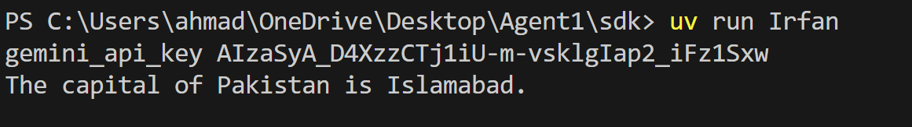

## Output of our code is:

## Explanation of My_Code:
## 1. Imports
Brings in tools for AI agents, environment loading, and Gemini API communication.

## 2. Load API Key
Reads the Gemini API key from a .env file to keep it secure and out of the code.

## 3. Verify Key (Dev Only)
Prints the key to confirm it loaded — useful for testing, not for production.

## 4. Set Up Gemini Client
Connects to Gemini using an OpenAI-style interface, pointing to Gemini's endpoint.

## 5. Register Client
Makes this Gemini client the default for all model requests in the script.

## 6. Disable Tracing
Turns off extra logs to keep output clean.

## 7. Prepare the Model
Wraps the gemini-2.0-flash model for OpenAI-style use.

## 8. Build Assistant
Creates an AI agent named “Assistant” with simple instructions.

## 9. Ask a Question
Sends a prompt: “What is the capital of Pakistan?” to the assistant.

## 10. Show the Answer
Prints the assistant’s reply to the terminal.